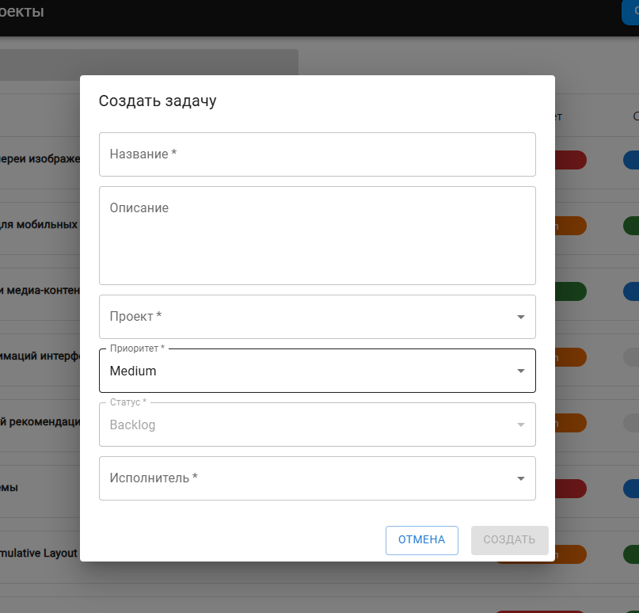

# avito-tech-trainee-assignment-spring-2025

## Оглавление

1. [Описание проекта](#описание-проекта)
2. [Технологический стек](#технологический-стек)
3. [Функциональные возможности](#функциональные-возможности)
4. [Установка и запуск](#установка-и-запуск)
5. [Обоснование дополнительных технологий](#обоснование-дополнительных-технологий)

## Описание проекта

Этот проект выполнен в рамках стажировочного задания от Avito Tech. Приложение позволяет управлять проектами и задачами: создавать, редактировать, просматривать и фильтровать

## Технологический стек

- **React** v18+
- **React Router DOM** для маршрутизации
- **Material UI (MUI)** как дизайн-система/UI-кит
- **Redux Toolkit** для управления состоянием
- **Axios** для асинхронных HTTP-запросов

## Функциональные возможности

# Header

Присутствует на всех страницах. Содержит ссылки на:

- Список задач (/issues)
- Список досок (/boards)
- Кнопку создания задачи

# Создание задачи

Форма создания задачи вызывается:

- Из Header на любой странице
- Форма открывается в виде модального окна

_Поддерживает предзаполненные поля_

Поля формы:

- Название задачи
- Описание
- Проект
- Приоритет
- Статус
- Исполнитель



# Просмотр задач

- Страница /issues отображает список всех задач во всех проектах
- Каждая задача содержит краткую информацию: название, исполнитель, приоритет, статус
- Клик по задаче открывает модальное окно с возможностью редактирования информации
- Есть возможность перейти из задачи на страницу доски проекта, к которому она принадлежит


# Фильтрация и поиск задач

На странице задач реализована фильтрация и поиск:

- По статусу задачи
- По доске, к которой прикреплена задача
- По исполнителю
- По названию задачи


# Страница досок

- Страница /boards отображает список всех досок (проектов)
- Клик по доске открывает страницу /board/:id со всеми задачами этой доски


# Страница доски проекта

- Задачи отображаются по колонкам в зависимости от их статуса
- Имеется возможность перетаскивать задачи (Drag-and-drop) между колонками:
  - Меняет статус задачи без перезагрузки страницы
  - Клик по задаче открывает модальное окно редактирования


# Смена статуса через компонент Chip

Для повышения удобства редактирования задач реализована возможность изменения статуса задачи напрямую через компонент Chip


## Установка и запуск

1. Клонирование репозитория

```bash
git clone https://github.com/liwiggwp/avito-tech-trainee-assignment-spring-2025
```

2. Настройка файла окружения

   - Скопируйте файл .env.example
   - Переименуйте в .env

3. Запуск проекта

```bash
docker-compose up --build
```

После успешного запуска:

- Фронтенд: http://localhost:3000
- Бэкенд: http://localhost:8080/swagger/index.html

## Обоснование дополнительных технологий

- **Material-UI (MUI):** современная дизайн-система с готовыми адаптивными компонентами, обеспечивающая быструю разработку интерфейса
- **Redux Toolkit**: удобное хранилище для централизованного управления состоянием приложения
- **Axios**: популярная библиотека для выполнения HTTP-запросов
- **Docker**: упрощает развертывание
